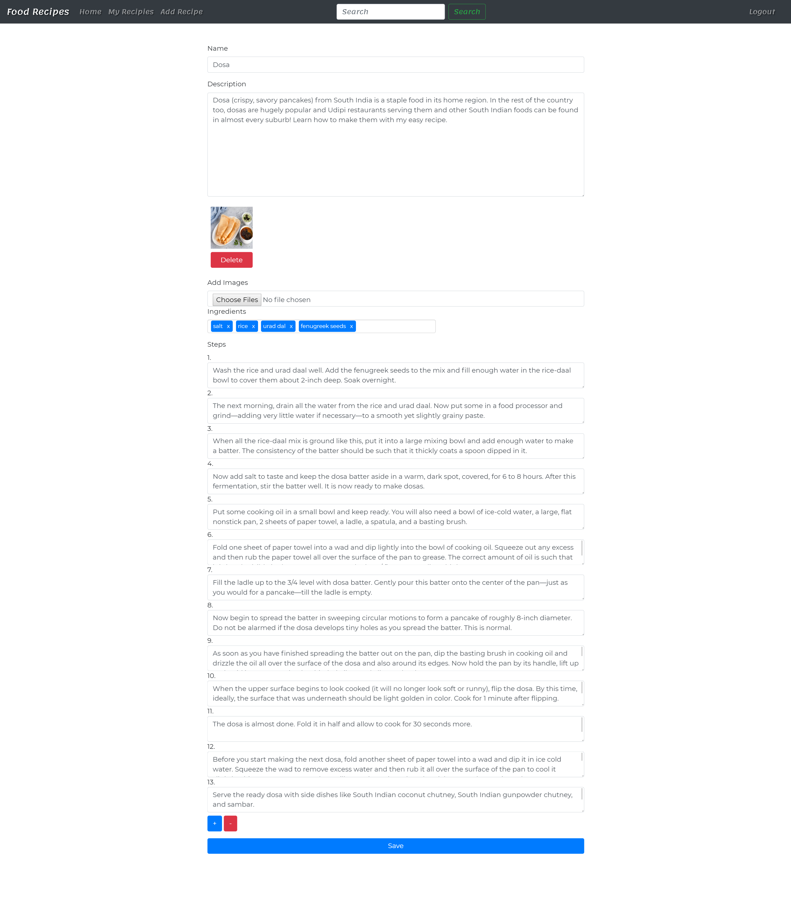

# Food Recipes
Food Recipes Web Application

## Built With
* Django

## Prerequisites
* Python 3.6 or higher
* Git

## Installation

### 1. Virtual Environment (optional)
```sh
python -m venv myenv
```
On Windows, run:
```sh
myenv\Scripts\activate.bat
```
On Unix or MacOS, run:
```sh
source myenv/bin/activate
```
<br>

### 2. Clone the repo
```sh
git clone https://github.com/maharshi-b/FoodRecipes.git
```
<br>

### 3. Install Python packages
```sh
pip install -r requirements.txt
```
<br>

### 4. Create Database
```JS
python manage.py migrate
```

<br>

### 5. Run Server
```JS
python manage.py runserver
```

## Tutorial

### To add new recipe, you have to signup with a username and login.

### You can view, search for recipes without authentication.


### Add new Recipe with images, description, title, ingredients and add or remove steps with the two buttons '+' and '-'.

### You can delete or edit the recipe in detail page.

### In Edit page, you can delete the old images and add new and save it.


